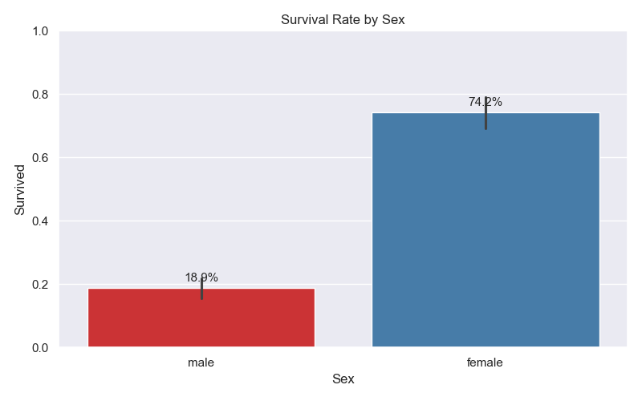
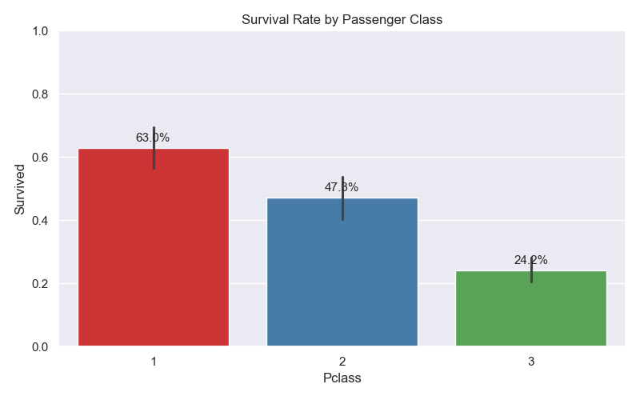
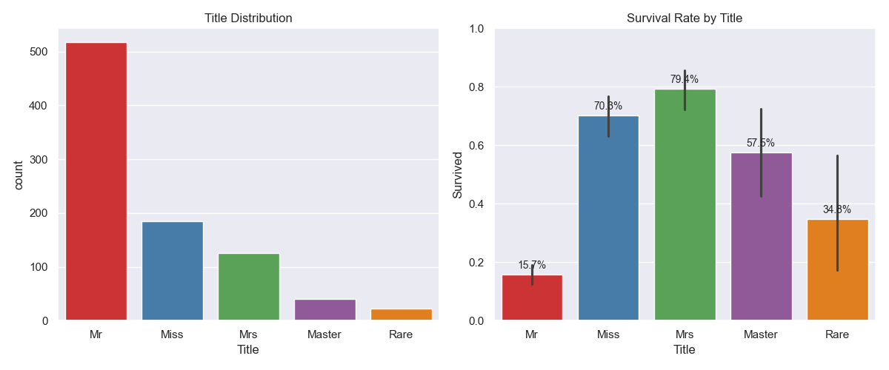
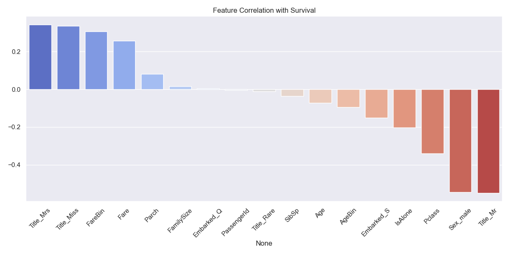

# Titanic Survivors

A solution to the Titanic Kaggle competition using Logistic Regression and feature engineering to predict passenger survival.

## Files
- `titanic1.py`: main script
- `train.csv`, `test.csv`: input data
- `my_submission.csv`: output predictions

## Usage
```bash
pip install -r requirements.txt
python titanic1.py
```

## Model
- Classifier: Logistic Regression
- Features: Pclass, Sex, AgeBin, FareBin, Embarked, Title, FamilySize, IsAlone

### Survival Rate by Sex


### Survival Rate by Passenger Class


### Title Distribution and Survival Rate


### Feature Correlation with Survival


### Missing Values

| Feature     | Missing Values |
| ---      | ---       |
| Age | 177         |
| Cabin     | 687|        |
| Embarked | 2 |